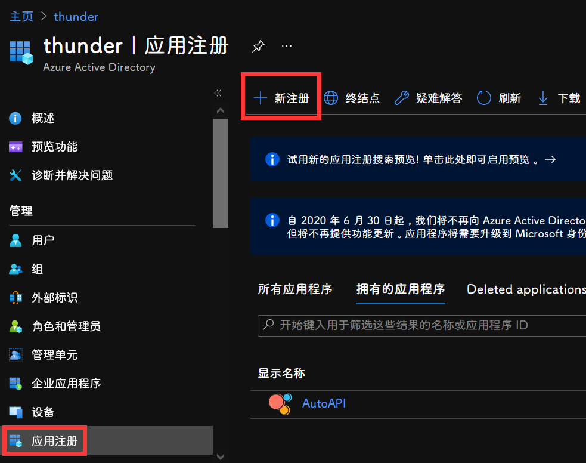
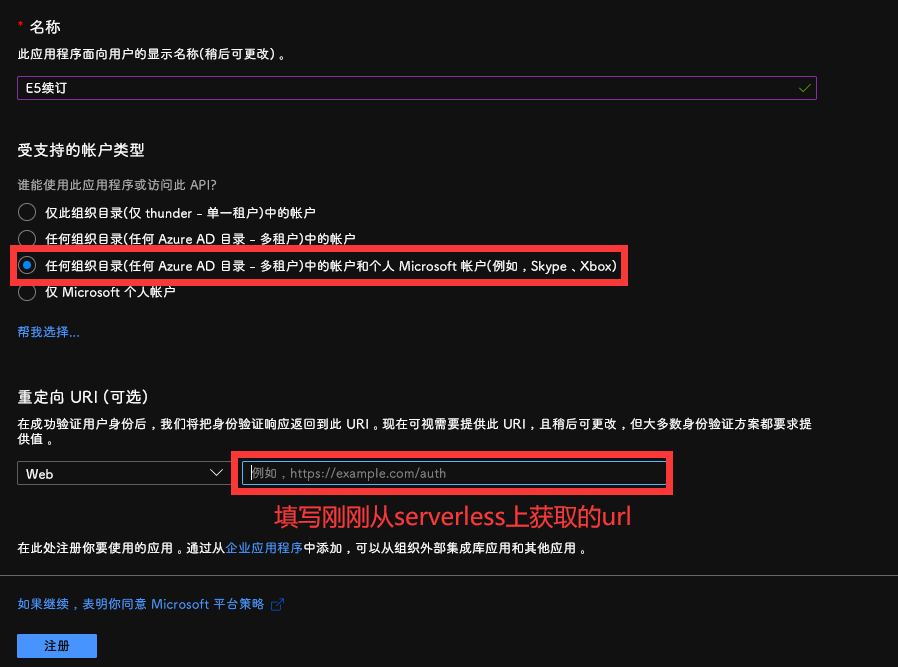
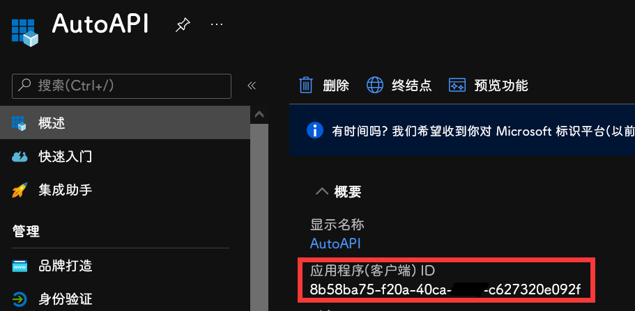
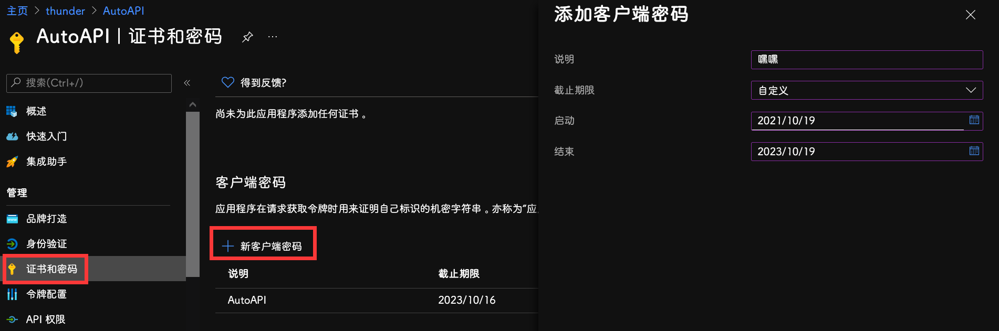

<div align="center">
    <h2>E5</h2>
    <div>A program developed with Nuxt3 to obtain refresh token.</div>
</div>

### setup

```sh
pnpm install
```

```sh
pnpm dev
```

### create app

登陆 [Azure](https://portal.azure.com/#blade/Microsoft_AAD_IAM/ActiveDirectoryMenuBlade/RegisteredApps) 创建应用



重定向 URL 填写 https://arcturus-e5.netlify.app



获取应用 ID



获取密钥

